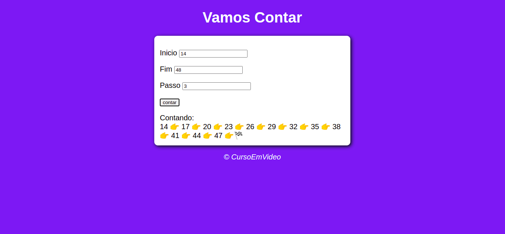
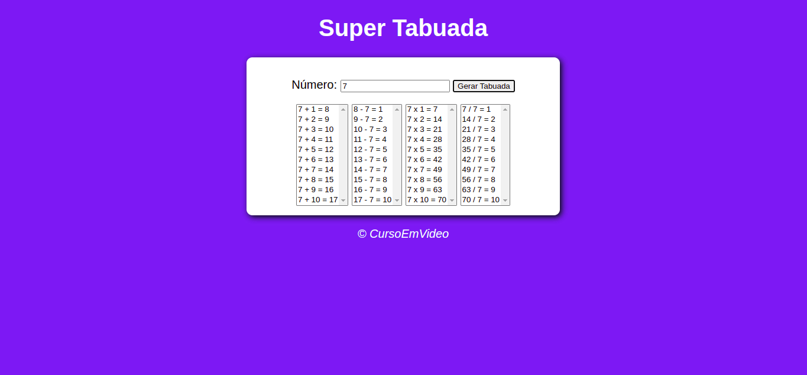
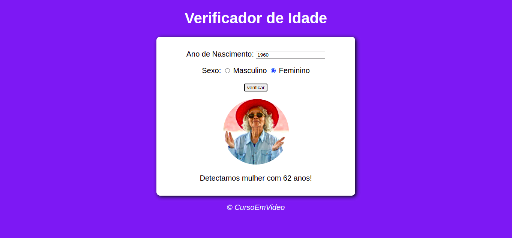

# Exercícios de JavaScript

  <a href="#sobre">Sobre</a>&nbsp;&nbsp;&nbsp;|&nbsp;&nbsp;&nbsp;
  <a href="#tecnologias-utilizadas">Tecnologias utilizadas</a>&nbsp;&nbsp;&nbsp;|&nbsp;&nbsp;&nbsp;
  <a href="#como-rodar">Como rodar?</a>&nbsp;&nbsp;&nbsp;|&nbsp;&nbsp;&nbsp;
  <a href="#licença-e-autores">Licença e autor</a>

## Sobre

Esse é um repositório com alguns exercícios do curso de JavaScript do Curso em Video, onde cada um dos desafios trabalha algum conseito basico da programação na linguagem JS.

Ao todo são 4 exercícios:

- Analisador de array: adiciona todos os números informados pelo úsuario a um array que quando
  verificado dá informçaões sobre o array como o resulta da soma de todos os números e a qauntidade de elementos.

- Contador: dados o número inicial, final e o "passo" é feito uma lista de números que vai desde o
  número inicial, somando o passo, até o final, iformados pelo úsuario.

- Tabuada: gera a tabuada das 4 operações basicas do número informado pelo úsuario.

- Verificador de idade: informa a idade da pessoa com base no ano de nascimento informado pelo
  úsuario, ilustrando com a imagem de uma pessoa com mais ou menos a mesma idade.

### Imagens de cada exercício

_Analisador de array:_

_Contador:_

_Tabuada:_

_Verificador de idade:_

## Tecnologias utilizadas

Esses exercícios foram desenvolvido utilizando as seguintes tecnologias:

### 💻 Front-end

- [HTML](https://developer.mozilla.org/pt-BR/docs/Web/HTML)
- [CSS](https://developer.mozilla.org/pt-BR/docs/Web/CSS)
- [JavaScript](https://www.javascript.com/)

## Como rodar?

- Basta abrir os aquivos .html para rodar.

## To do

Alguma ideia para melhorar esse repositório?

Sinta-se livre para sugerir novas melhorias e correções [criando uma issue](https://github.com/DiegoImperiano/curso-js/issues/new) 😉.

## Licença e autor

Este projeto está sob a licença MIT. Veja o arquivo [LICENSE](https://github.com/DiegoImperiano/curso-js/blob/main/LICENSE) para mais detalhes.

Desenvolvido por [Diego Imperiano](https://github.com/DiegoImperiano).

